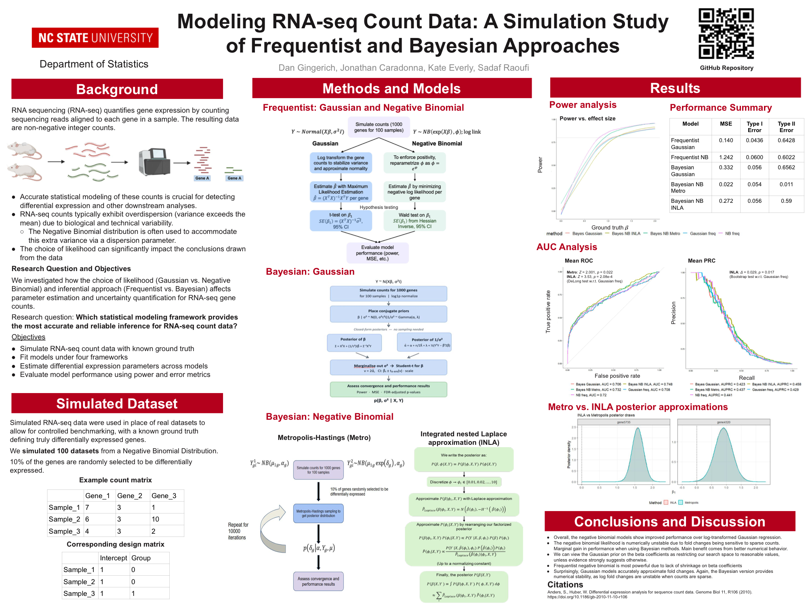

# RNA-seq Model Benchmarking

A simulation study comparing **frequentist** and **Bayesian** statistical models for detecting differentially expressed (DE) genes in RNA-seq count data. All models are implemented from scratch in base R; auxiliary packages are used only for evaluation and plotting.

---

## Poster

A one-page summary of the methodology, simulation setup, and benchmarking results — presented at the NC State University Department of Statistics.

[](poster/poster.pdf)

📄 [Download the full-resolution PDF](poster/poster.pdf)

---

## Repository Structure

```
bayesian/      Bayesian models
  bayesian_gaussian.R                   Conjugate Bayesian Gaussian (per gene)
  bayesian_negative_binomial_inla.R     NB via INLA / Laplace approximation
  bayesian_negative_binomial_metropolis.R   NB via Metropolis-Hastings MCMC sampler

frequentist/   Frequentist models and evaluation
  Gaussian_Frequentist.R                Per-gene Gaussian GLM
  Frequentist_NB.R                      Per-gene Negative Binomial GLM (custom MLE)
  running_freq_gaussian.R               Driver: runs Gaussian model over 100 simulations
  run_freq_neg_binom.R                  Driver: runs NB model over 100 simulations
  plot_ROC_and_PROC.R                   ROC + Precision-Recall curves across all models

data/          Simulator and pre-generated data
  data_simulator.R                      Generates simulated RNA-seq count datasets
  data_simulator___sim1.rds ... sim100.rds   100 simulated datasets
```

---

## Quickstart

Install required R packages:

```r
install.packages(c("PRROC", "dplyr", "ggplot2", "mvtnorm", "pROC", "tidyr"))
```

(Optional) regenerate the simulated data:

```bash
Rscript data/data_simulator.R
```

Run a frequentist analysis end-to-end:

```bash
Rscript frequentist/Gaussian_Frequentist.R
Rscript frequentist/running_freq_gaussian.R
Rscript frequentist/run_freq_neg_binom.R
Rscript frequentist/plot_ROC_and_PROC.R
```

---

## Simulation Setup

Each of the 100 simulated datasets contains:

* **100 samples** — 50 control + 50 case
* **1000 genes**
* Counts drawn from a **Negative Binomial** distribution (realistic for RNA-seq: variance > mean)
* **10% of genes** are truly differentially expressed (ground-truth labels stored alongside the counts)
* Genes are simulated as **independent** (the standard assumption for these models)

---

## Models Compared

| Framework   | Distribution        | Implementation notes                                   |
| ----------- | ------------------- | ------------------------------------------------------ |
| Frequentist | Gaussian            | Per-gene linear model after library-size normalization |
| Frequentist | Negative Binomial   | Per-gene GLM with custom MLE (gradient + Hessian)      |
| Bayesian    | Gaussian            | Conjugate posterior with Normal-Inverse-Gamma priors   |
| Bayesian    | Negative Binomial   | Metropolis-Hastings sampler                            |
| Bayesian    | Negative Binomial   | INLA / Laplace approximation                           |

---

## Evaluation Metrics

For every simulation, every model produces:

* **Error rates** — Type I error, Type II error, false discovery proportion (FDP)
* **Confusion matrix** — true/false positives and negatives
* **Classification metrics** — precision, recall, F1
* **Coefficient quality** — bias of β̂, MSE on log2 and fold-change scales, correlation with truth, posterior coverage
* **Curves** — ROC (with mean AUROC) and Precision-Recall (with mean AUPRC), averaged over the 100 simulations

---

## Motivation

Many RNA-seq pipelines rely on simplifying assumptions, most commonly Gaussian approximations of count data. This project asks:

* How much do those assumptions affect the conclusions we draw?
* Does a count-aware model (Negative Binomial) produce more reliable inference?
* Do Bayesian methods buy us anything over the frequentist equivalents on the same data?

---

## Big Picture

This project sits at the intersection of:

* **Statistics** — modeling assumptions and inference
* **Bioinformatics** — gene expression analysis
* **Computation** — simulation and from-scratch algorithm implementation

The aim is to better understand *which models are reliable for detecting true biological signals in RNA-seq data*.

---

## Contributors

- Jonathan Caradonna — Bayesian Negative Binomial (Metropolis)
- Sadaf Raoufi — Bayesian Gaussian, Bayesian Negative Binomial
- Kate Everly — Frequentist Gaussian, Frequentist Negative Binomial
- Dan Gingerich — Bayesian Gaussian, Bayesian Negative Binomial (INLA)
